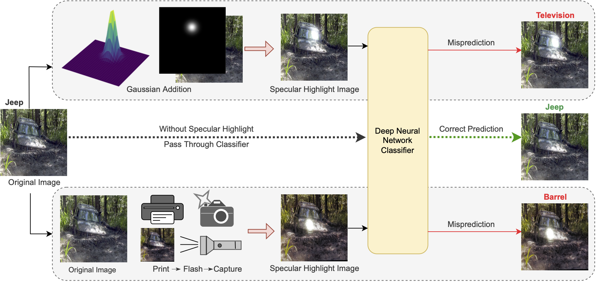
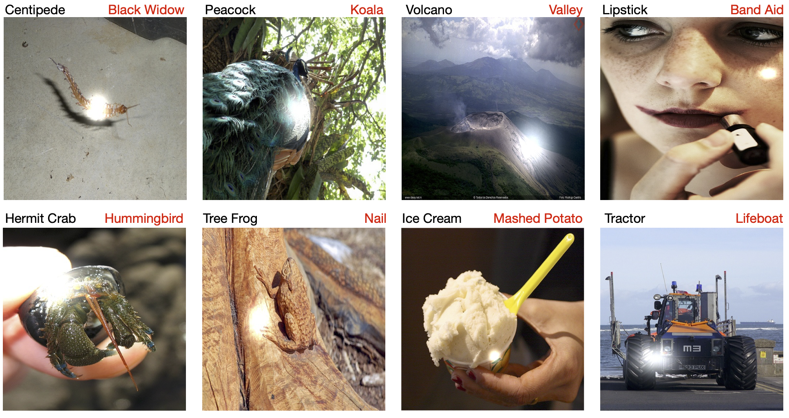
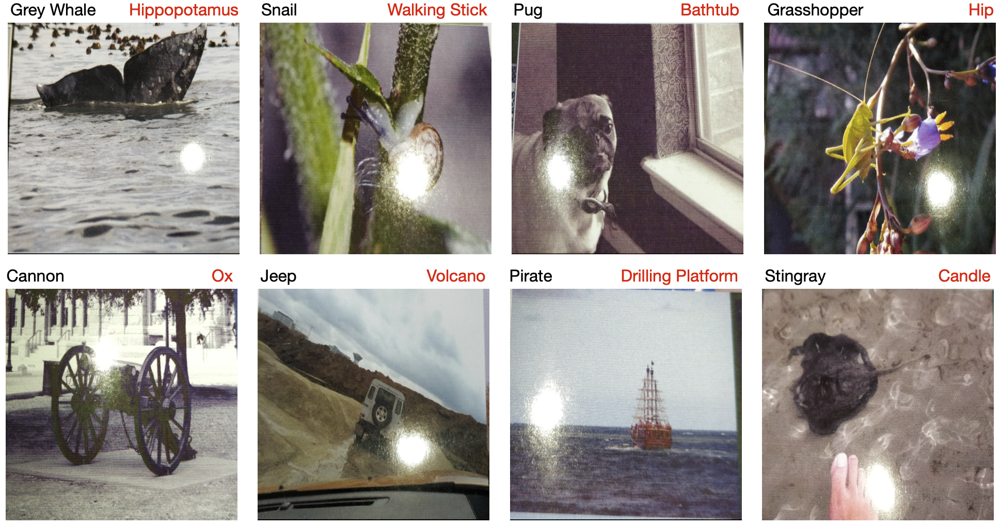

# Adversarial Examples with Specular Highlights

We introduce specular highlight as a natural adversary and examine how deep neural network classifiers can get affected by them, resulting in a reduction in their prediction performance.

Paper

We also provide two datasets, ImageNet-AH and ImageNet-PT, depicting:

- **ImageNet-AH**: Artificially generated augmentations of Gaussian specular highlights [[Download]](https://drive.google.com/drive/folders/1xEwymaOZnKzOiBqqdBrurMTNIgP5ZYuk?usp=sharing)
- **ImageNet-PT**: Actual specular highlights on the printed images [[Download]](https://drive.google.com/drive/folders/14BqEKZYOWqP7Jsi4O1W18A3qucUG80oh?usp=sharing)



### ImageNet-AH
ImageNet Augmented Highlight (ImageNet-AH) is a collection of specular highlighted images (using augmentation) with specular highlights at various locations and intensities. This specially curated dataset contains those specular augmentations that fooled the classifiers into making a wrong decision but had their original images correctly classified. This will help us to claim that when we put a specular highlight on the image, the models change their decision towards a misclassification. The dataset is curated in such a way that we get a pool of failed images, mispredicted by any of the pre-trained classifiers considered in this study. The meta data contains each model prediction, with the current class, the intensity of specular highlight, image name, incorrect predicted class code, and the incorrect predicted class name. The images were selected from the validation set of the [ImageNet-1k dataset](https://www.image-net.org/).

The image name is saved as ```(<ImageNum>_<Class>_<ClassName>_<Intensity>_<Position>)```. Here, the position (P) number varies from 1-100. Since the image is divided into 5x5 grid (25 unique positions), P represents one of those 25 positions per intensity value (I(sigma) = 10, 20, 30, 40). The counting is row-first, and hence the total P values are ```P * I(sigma) = 25*4 = 100```. 



The figure above shows some examples of ImageNet-AH, where the black text is the correct class, and the red text is the incorrect class.


### ImageNet-PT
ImageNet Print+Torch (ImageNet-PT) is a subset of 10 classes from ImageNet-AH, printed on glossy photography papers, with actual specular highlights thrown on them. The images are such selected that they were originally classified correctly by ResNet-101 in the experiment of ImageNet-AH, but their specular highlight variation failed. This way, the current experiment would be able to prove the claim made by the previous experiment
about the failure classifiers in the case of specularly affected adversarial images ResNet-101 is chosen because of its widespread use and good classifier performance on ImageNet-AH.



The figure above shows some examples of ImageNet-PT, where the black text is the correct class, and the red text is the incorrect class.

## Citation
If you find this useful in your research, please consider citing:
```
@inproceedings{vats2023,
  title={Adversarial Examples with Specular Highlights},
  author={Vats, Vanshika and Jerripothula, Koteswar Rao},
  booktitle={2023 IEEE/CVF International Conference on Computer Vision Workshops (ICCVW)},
  year={2023},
  organization={IEEE/CVF}
}

@inproceedings{imagenet,
  title={Imagenet: A large-scale hierarchical image database},
  author={Deng, Jia and Dong, Wei and Socher, Richard and Li, Li-Jia and Li, Kai and Fei-Fei, Li},
  booktitle={2009 IEEE conference on computer vision and pattern recognition},
  pages={248--255},
  year={2009},
  organization={IEEE}
}

```


